# Band Website (DJ Shadow)

## 1st Milestone Project

## User Centric Front-End Development

## Code Institute 2020

---

The brief for this project was to build a website to represent a band, which would
appeal to both new and existing fans. The music artist DJ Shadow was chosen as the
subject for this purpose. The design was based on user experience priciples and a
responsive mobile first method was employed. The purpose of this wesite is to provide
users with:

- useful and appealing information about the artist
- links to samples of his music (videos/spotify)
- links to his social media
- upcoming touring dates & ability to contact his management
- photos
- merchandising
- newsletter sign-up

---

### See the image below for an example of the responsiveness of the site.

Click the image to be taken to a live demo of the site:

[![homepage][1]][2]

[1]: ./documentation/images-for-readme/am-i-responsive.JPG
[2]: https://robot5000-design.github.io/project_one/index.html "Live Site"

---

### **Contents:**

[1. UX Design](#1-ux-design)

[2. Features](#2-features)

[3. Technologies Used](#3-technologies-used)

[4. Testing](#4a-testing-part-1)

[5. Deployment](#5-deployment)

[6. Credits](#6-credits)

---

### **1. UX Design**

#### Strategy

_User Stories:_

There are 3 types of users of the site: the artist(site owner), the fans or the organiser of an event.

As the site owner:

- I want to present myself and my music in a positive way and in a style that fits with my image and my music.
- I want fans to be drawn in by the landing page.
- I want fans to know when and where I am playing live.
- I want fans to be able to listen to samples of my music and be directed to spotify where I make money from their repeat listens.
- I want my new album to be promoted but to use my well-known material to promote the site.
- I want fans to be able to purchase merchandise.
- I want fans to be able to keep up to date with what is going on in my world through links to my social media and either a news feed or newsletter sign-up.
- I want a contact form for event organisers to be able to get in touch with my management for potential gigs.

As a fan:

- I want to be able to get links to new and old music and videos.
- I want to be able to purchase merchandise.
- I want to be able to stay up to date with news and link to social media sites.
- I want to be able to see where the artist is touring next or if they might be playing local to me soon.
- I want to be able to quickly find bio information about the artist.
- I want to see photos of the artist.

As an event organiser:

- I want to see what the artists upcoming touring schedule looks like and to have the means to contact the artists management.

The main goals of this site, arising from the user stories and research of other musician sites are:

- to have useful and appealing information about the artist.
- to have links to samples of their music (videos/spotify).
- to have links to their social media.
- to have upcoming touring dates & ability to contact their management
- to have a selection of photos.
- to have merchandising.
- to have a news page or a newsletter subscriber sign-up.

#### Scope

Based on the results of the Strategy research the features to be included are:

- Landing page with iconic Endtroducing image.
- Gallery with photos from official Instagram.
- Music page with links to all albums on Spotify.
- Embedded Youtube videos of some well known music pieces.
- A newsletter subscription form.
- A bio page.
- An upcoming gigs page with the ability to contact management.
- From the Strategy Table and graph it was clear that all features are viable except an online shop at
  this moment and a newsletter sub is more suitable to this project rather than a news feed page.
  A link to the official DJ Shadow online shop can be provided instead for the moment.

#### Structure

- A simple tree and branch layout with few pages, all accessible from the navigation bar at
  the top of the page where the user expects.
- Tree structure implemented with navbar for mobile users and linear path on gallery page
  if necessary to reduce the number of photos on screen all at once.
- Custom 404 page, so in the case of a broken external link a button is provided
  for the user to return to safety.

#### Skeleton

Wireframes made in Balsamiq Wireframes were used for basic layout. These can be viewed here:

[Landing Page All Sizes](./documentation/wireframes/landing_page.png)

[Music Page All Sizes](./documentation/wireframes/music_page.png)

[Tour Page All Sizes](./documentation/wireframes/live_page.png)

[Gallery Page All Sizes](./documentation/wireframes/gallery_page.png)

[About Page All Sizes](./documentation/wireframes/about_page.png)

[Merch Page All Sizes](./documentation/wireframes/merch_page.png)

#### Surface

Colours were chosen based on the 20th aniversary edition of DJ Shadow's seminal album, Endtroducing.
This also provided the main logo/icon for the nav element.

The main background colour #9F8A38 was darkened slightly to provide more contrast with the text.
This allowed the site to score 100 in the Accessibility category on Chrome Development Tools Lighthouse.

The fonts chosen were Bebas Neue for headings (bold eye-catching font) and Roboto Mono for everything else.
Text colour is an off-white #FAFAFA contrasted with #3F3F3F for icons and footer.

[Figma](https://www.figma.com/) was used to check colours
and basic theme. The Figma mock-up can be viewed [here](./documentation/images-for-readme/figma-mock-up.jpg).

![ColourChoices][3]

[3]: ./documentation/images-for-readme/color-choices.jpg "Colour Choices"

---

### **2. Features**

Common to all pages, a nav element with navigation links at the top of the page. This is fixed
on mobile to give easy access where the smaller screen results in more scrolling. A navbar
is also utilised on smaller screen sizes. Icons have been used to complement all headings.
A media query allows the nav to scroll again for when height is limited, such as a small
device in landscape mode.

In addition all pages have a constant footer which contains links to social media, terms(doesn't exist)
and privacy(doesn't exist). These links provide interactive feedback when hovered over,
they change colour.

Customised Bootstrap was used to help with the responsiveness and layout of the site.
In addition targeted media queries were used to assist with this.

More detailed information on features of each page:

_1. Home:_

Landing page with large hi-res eye-catching widescreen version of the famous photo
used on the original Endtroducing album cover. An opaque overlay gradually lights
up from dark when you arrive on the page. This gives the impression of the lights being
switched on in the music store as you look through a window.

Embedded classic video from Endtroducing in addition to an image of the new album
with an opaque overlay on hover which has a link to the album on Spotify.

A form to sign-up for a subscriber newsletter. Email address is required (Form does
not send data).

_2. Music:_

Selection of all album covers that when hovered over, the opaque overlay contains
information on the album and a link to the album on Spotify. Selection of embedded
Youtube videos to draw in new listeners.

_3. Tour:_

List of upcoming touring dates and contact form modal to contact management. All inputs
are required (Form does not send data).

_3. Gallery:_

Page of photos from the official Instagram, laid out in an ad-hoc poster board
format. Linear pagination used to spread photos over two pages as necessary.

_4. About:_

Some bio info about the artist with appropriate photos.

_5. Merch:_

Link to the official DJ Shadow online Shop.

_Other potential features which could be implemented in future:_

- Have an online shop built into the site.
- A news page rather than subscriber news.
- Embedded Instagram rather than current Gallery page.

These would allow the website to be constantly updating which would keep users
coming back.

---

### **3. Technologies Used**

_IDE and Languages:_

- Gitpod - IDE used.
- HTML - Base structural language.
- CSS - Language used for styling.

_Libraries:_

- Bootstrap 4.5.2 - Used to help with grid layout and screen size responsiveness.
- Javascript, Popper.js, and jQuery as part of Bootstrap.
- Font Awesome for icons.
- Google Fonts for Bebas Neue and Roboto Mono fonts.

_Hosting and Version Control:_

- Github - Holding repository and hosting site.
- Git - Version control.

_Others:_

- Balsamiq - For wireframes.
- Figma - For partial colour mock-up of home page.
- Microsoft Paint 3D - For colourmatch.
- Browserstack - To check base compatibility.
- freeformatter.com - to format html files.
- tinyJPG - to reduce image file size.
- Autoprefixer - used to automatically add browser compatibility prefixes.

As per industry practice and to reduce the number of small commits on the master branch,
seperate branches were created and used for the individual pages (where appropriate) and
for the readme file as they were developed. These were squashed, merged and deleted
after use.

---

### **4a. Testing Part 1**

The first part of testing was to confirm that all user stories requirements have been met.

For the site owner:

- I want to present myself and my music in a positive way and in a style that fits with my image and my music.

  _This has been achieved by the overall style, font, colours and images used on the site._

For the site owner:

- I want fans to be drawn in by the landing page.

  _This has been achieved by using the iconic photo from the Endtroducing Album cover and lighting it
  up gradually._
  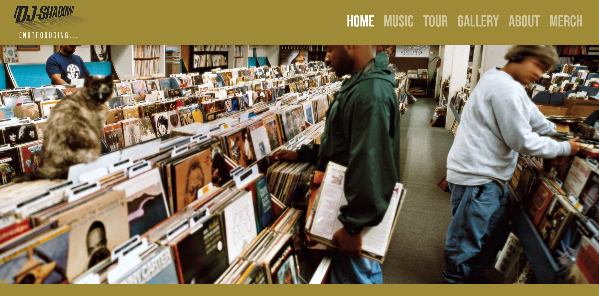

For the site owner:

- I want fans to know when and where I am playing live.

For a fan:

- I want to be able to see where the artist is touring next or if they might be playing local to me soon.

  _Achieved with the Tour page_
  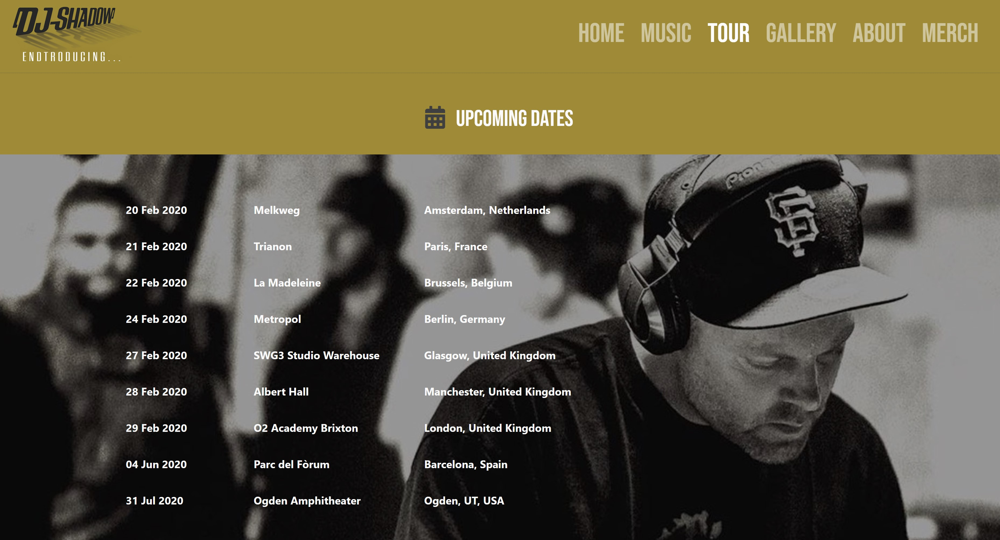

For the site owner:

- I want fans to be able to listen to samples of my music and be directed to Spotify where I make money from their repeat listens.

For a fan:

- I want to be able to get links to new and old music and videos.

  _Achieved with the Music page having sample music videos and links to all
  albums on Spotify._
  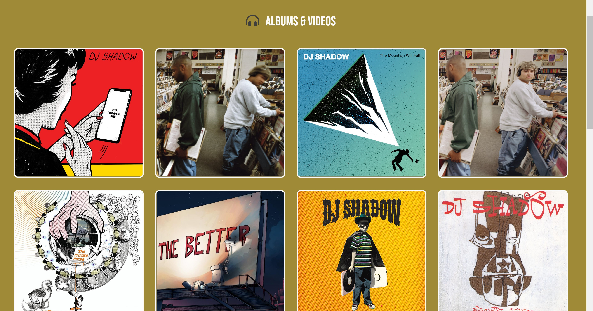
  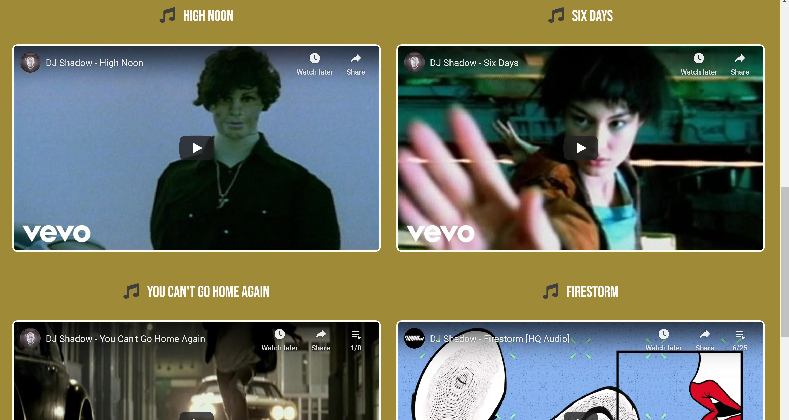

- I want my new album to be promoted but to use my well-known material to promote the site.

  _Acheived by using a mix with older imagery, videos and links to both new and
  old albums on the Music page. On the Landing page there's an older well known
  video along side a link to the latest album on Spotify._
  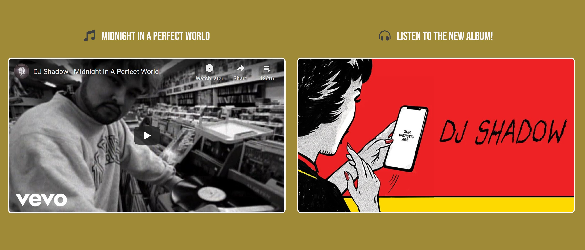

For the site owner:

- I want fans to be able to purchase merchandise.

For a fan:

- I want to be able to purchase merchandise.

  _Achieved by providing a link to the official online store._
  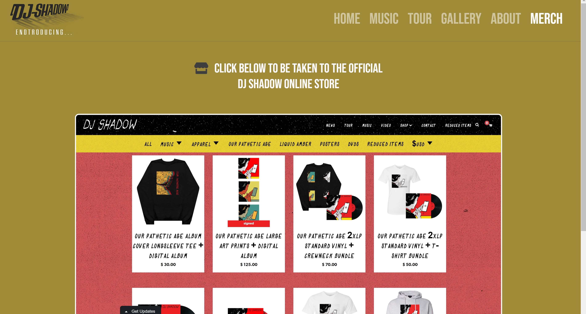

For the site owner:

- I want fans to be able to keep up to date with what is going on in my world
  through links to my social media and either a news feed or newsletter sign-up.

For a fan:

- I want to be able to stay up to date with news and link to social media sites.

  _Achieved by providing a subscriber newsletter sign-up form and links to social
  media in footer. It should be noted that this form is non-functioning with
  regards to sending data, as that is beyond the scope of this project._
  
  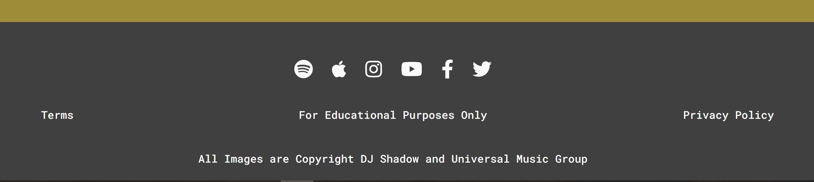

For the site owner:

- I want a contact form for event organisers to be able to get in touch with my management for potential gigs.

For an event organiser:

- I want to see what the artists upcoming touring schedule looks like and to have
  the means to contact the artists management.

  _Achieved by providing a modal contact form for event organisers at the bottom of
  the Tour page. It should again be noted that this form is non-functioning with regards to sending data, as that is beyond
  the scope of this project._
  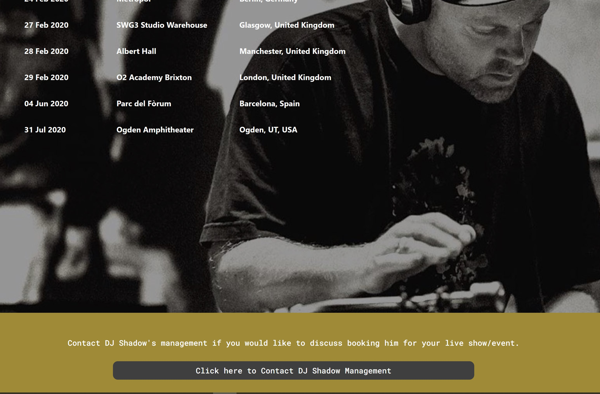

For a fan:

- I want to be able to quickly find biography information about the artist.

  _Achieved by the About page having a bio information with photos._
  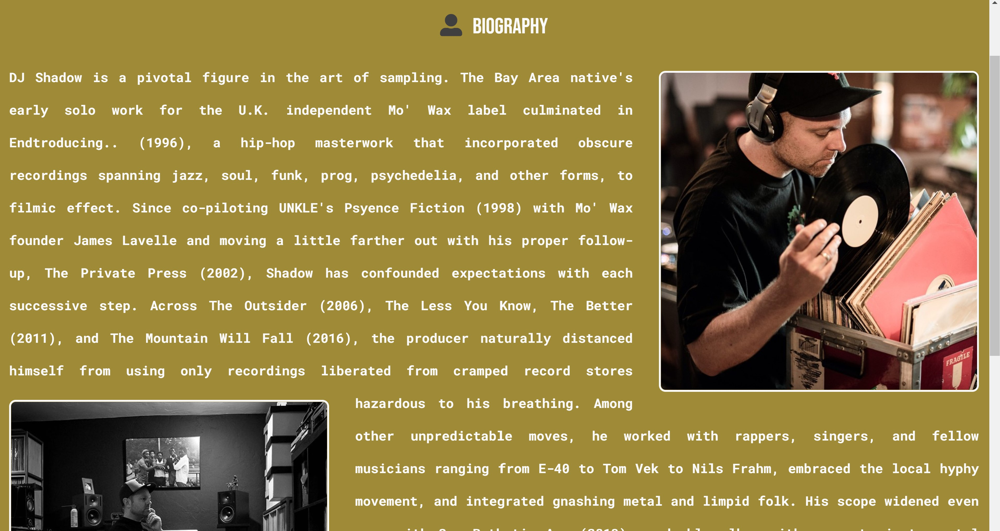

For a fan:

- I want to see photos of the artist.

  _Achieved by the Gallery page having up-to-date photos from artists Instagram._
  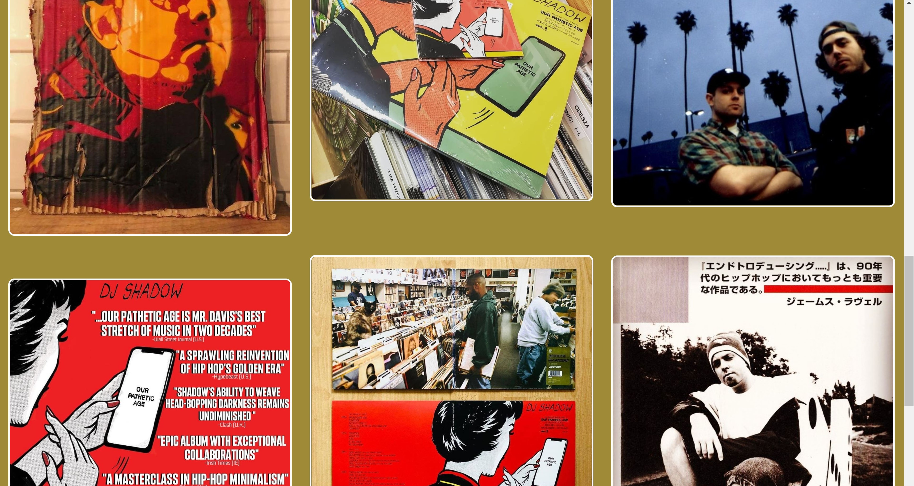

---

### **4b. Testing Part 2**

The site has been tested on the following browsers on Windows 10:

- Internet Explorer
- Firefox
- Google Chrome
- Safari
- Samsung on Android
- Opera
- Microsoft Edge

The site has been tested on both mobile and desktop for responsiveness.
In addition to Chrome Development Tools, BrowserStack allowed for limited additional
testing on Apple desktop and mobile.

Any issues have been cataloged in the Issues section on Github and closed
when a sufficient solution was reached.

Further testing of links and responsiveness can be found in the [test document](./documentation/test.md).

All HTML and CSS files have been passed through the w3c validation service here
https://validator.w3.org/

The only issue of significance raised through the validator was issue #10. The 404.html
code had an anchor element wrapped in a button. The solution was to use the anchor element
only, but styled as a button.

_Chrome Dev Tools Lighthouse made a number of suggestions:_

- for security reasons rel="noreferrer" should be added to all external links.
  It indicates that no referrer information is to be leaked when following the link
  and also implies the noopener keyword behavior under the same conditions (taken
  from HTML Living Standard website).

- the embedded video iframe elements should have
  a title for screen readers. This has been added.

- remove the user-scalable="no" from the meta element.
  Again for accessability reasons. This has been removed.

- size of images were reducing performance. All images have been reduced in size.

- form inputs had no label. This is for styling reasons with only placeholder text present.
  An appropriate aria-label has been added to each form input for assistive technology as
  suggested here (https://www.w3.org/WAI/tutorials/forms/labels/#hidden).

- pages did not have a meta description for search engine optimisation. This has now been added.

_The Chrome Dev Tools Lighthouse scores are now as follows:_

- Index Page:
  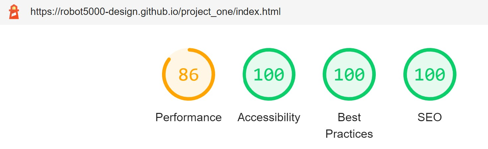

- Music Page:
  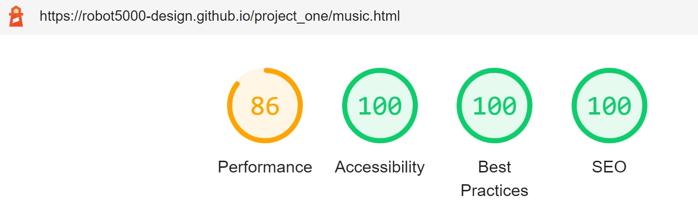

- Tour Page:
  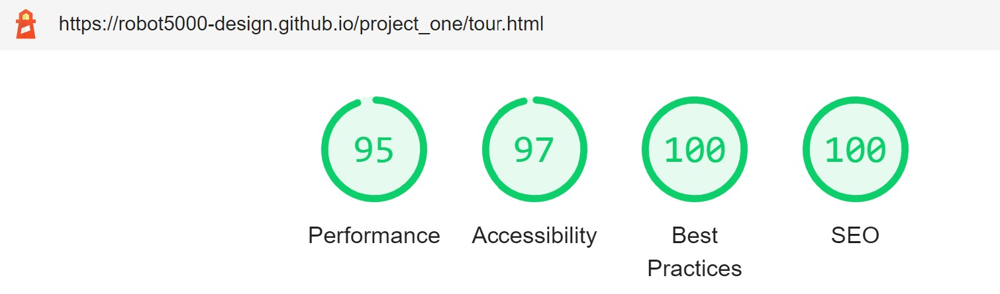

- Gallery Page:
  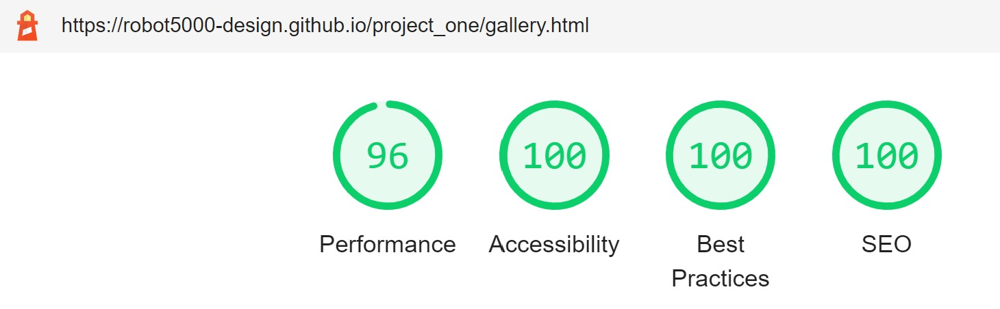

- About Page:
  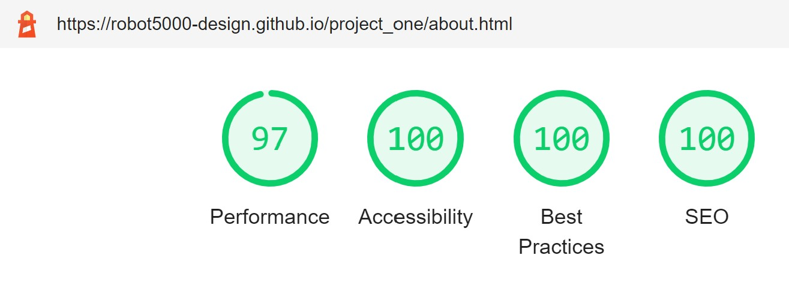

- Merch Page:
  

Another significant issue in testing was on mobile devices where the browser address bar
appears and disappears as the user scrolls. This was causing a scaling issue where the fixed
background image set to 100vh would jump in scale slightly. To overcome this problem
on Chrome the background hero image on the landing page was allowed to scroll on mobile
devices only. Unfortunately changing it to scroll spoils the original effect but from research,
this appears to be a known issue which can be solved with Javascript, but that is beyond the
scope of this project right now.

All links both internal and external have been tested and verified from each page in turn. External
links open in a new tab. As stated previously neither the subscribe or contact forms send data.
All social media links have been obtained from the official DJ Shadow website. While they all work,
w3c Link Checker showed that three of the links are redirected (to the correct location). It has not 
been possible to verify the functionality of the iTunes link without a valid iTunes account. Link 
checker showed a server side problem with this link.

---

### **5. Deployment**

The site has been deployed on Github pages [here](https://robot5000-design.github.io/project_one/index.html).

_To Deploy on Github Pages:_

1. On Github, navigate to Settings in the Github repository.
2. Scroll down to the Github Pages section.
3. Under Source, select the Master branch.
4. Press Save.
5. After it saves, scroll back down to the Github Pages section and the URL for
   where the site is published will now be available.

_For this website to be run locally it can downloaded as a ZIP file or it can be cloned:_

- To download and run a local ZIP copy:

  1. On GitHub, navigate to the main page of the repository.
  2. Above the list of files, click Code.
  3. Click Download ZIP.
  4. Navigate to the local Downloads folder and un-zip the project_one-master folder.
  5. Open the file index.html in an internat browser.

- To Clone using Command Line:

  1. On GitHub, navigate to the main page of the repository.
  2. Above the list of files, click Code.
  3. To clone the repository using HTTPS, under "Clone with HTTPS", copy the URL.
     To clone the repository using an SSH key, including a certificate issued by your organization's
     SSH certificate authority, click Use SSH, then copy the URL.
  4. Open Git Bash.
  5. Change the current working directory to the location where you want the cloned directory.
  6. Type git clone, and then paste the URL you copied earlier: \$ git clone url-copied-earlier
  7. Press Enter to create your local clone.

- To Clone using Github Desktop:

  1. On GitHub, navigate to the main page of the repository.
  2. Above the list of files, click Code.
  3. Click "Open with GitHub Desktop" to clone and open the repository with GitHub Desktop.
  4. Follow the prompts in GitHub Desktop to complete the clone.

---

### **6. Credits**

- All images in the gallery are taken from the official DJ Shadow Instagram.

- All embedded video are from the official DJ Shadow YouTube channel.

- All album covers are taken from https://www.discogs.com/artist/4478-DJ-Shadow

- Paragraph on the Home page is taken from the AllMusic review of the album Endtroducing and can be found
[here](https://www.allmusic.com/album/endtroducing-mw0000082992).

- Paragraph on the About page is taken from the AllMusic DJ Shadow Biography page and can be found
[here](https://www.allmusic.com/artist/dj-shadow-mn0000949820/biography).

- Information on deployment was taken from Github Documentation
[here](https://docs.github.com/en/github/creating-cloning-and-archiving-repositories/cloning-a-repository).

- Mentor for time and advice.

- Friends and family who tested the site.

---
